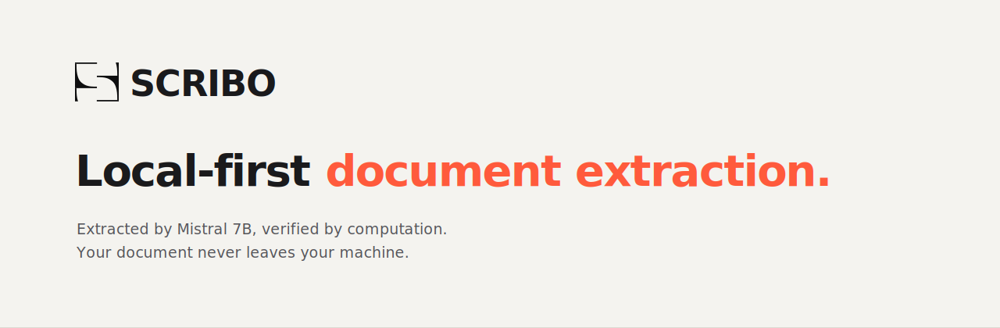

<p align="center">
  
</p>

<p align="center">
  <strong>Extraction de champs depuis des documents, sans qu'aucune donnée ne quitte la machine.</strong><br>
  Mistral 7B tourne en local via MLX · les valeurs sont vérifiées par le calcul, pas seulement générées.
</p>

<p align="center">
  <a href="#-lancer-en-local">Lancer en local</a> ·
  <a href="#-le-problème-produit">Le problème</a> ·
  <a href="#-larchitecture">Architecture</a> ·
  <a href="#-décisions-techniques">Décisions</a> ·
  <a href="#-limites-assumées">Limites</a>
</p>

---

## En une phrase

Scribo lit un document (un RIB, pour commencer), en extrait les champs utiles, **recontrôle chaque valeur par une règle de calcul**, et les rend prêts à coller dans un formulaire — le tout en tournant **entièrement sur la machine de l'utilisateur**, sans appel réseau.

C'est un prototype produit : il fonctionne de bout en bout, mais il est volontairement resté simple pour rester lisible. Ce README explique autant le *raisonnement produit* que le code.

---

## ⚡ Lancer en local

> ⚠️ **Plateforme : Mac Apple Silicon uniquement** (puce M1, M2, M3 ou plus récente).
> Scribo **ne fonctionne pas** sur Windows, Linux, ni sur Mac Intel, car son moteur d'inférence repose sur **MLX**, la bibliothèque d'Apple spécifique à ses puces. Une version portable (via llama.cpp) pourra être envisagée plus tard.

Scribo s'installe avec **[uv](https://docs.astral.sh/uv/)**, qui gère tout pour vous : il installe la bonne version de Python si elle manque, crée un environnement isolé et télécharge les dépendances — le tout automatiquement. **Pas besoin d'avoir Python au préalable.**

**1. Installez `uv`** (une seule fois, si vous ne l'avez pas déjà) :

```bash
curl -LsSf https://astral.sh/uv/install.sh | sh
```

**2. Récupérez Scribo**, au choix :

```bash
# avec git
git clone https://github.com/Gabsuisse/scribo.git
cd scribo
```

*Ou sans git : téléchargez le ZIP depuis la page GitHub (bouton vert **Code → Download ZIP**), décompressez-le, et ouvrez le dossier dans le Terminal.*

**3. Lancez Scribo** — cette seule commande installe Python si besoin, toutes les dépendances, puis démarre le serveur :

```bash
uv run extracteur.py
```

Puis ouvrez **http://localhost:8000/extractorultimator.html** dans votre navigateur.

> À la première extraction, le modèle (~4 Go) se télécharge une fois. Ensuite, tout est local.

Déposez un document — **PDF ou image, Scribo s'adapte tout seul** — cliquez sur **Extraire**, et copiez les champs d'un clic. Rien ne part sur le réseau : vous pouvez couper le Wi-Fi et vérifier.

---

## 🗺️ Évolution envisagée

Une **application Mac double-cliquable** (`.app`, sans terminal) est à l'étude pour un usage grand public — elle demande une étape de packaging et de signature Apple, réservée à un futur lancement. En attendant, `uv` offre le parcours le plus simple : une commande, aucun prérequis Python.

---

## 🎯 Le problème produit

Remplir à la main les champs d'un formulaire de souscription à partir d'un document (recopier un IBAN de 27 caractères, un BIC, un titulaire) est lent et source d'erreurs. Des outils existent pour automatiser ça — mais presque tous **envoient le document vers un serveur distant** pour l'analyser.

Pour un particulier sur son propre RIB, ça n'a aucune importance. Mais dès qu'une organisation traite les documents **d'autrui** et doit en répondre — santé, secteur public, professions réglementées — envoyer une pièce sensible dans un cloud tiers devient un problème de conformité, pas de confort.

**L'angle de Scribo : et si le modèle venait au document, au lieu que le document parte vers le modèle ?**

C'est une décision produit avant d'être une décision technique. Le choix du traitement local n'est pas un goût de bricoleur : c'est ce qui rend une promesse — « rien ne sort » — vraie *par construction* plutôt que *par contrat*.

---

## 🏛️ L'architecture

```
┌─────────────────────── machine de l'utilisateur ───────────────────────┐
│                                                                         │
│   document              serveur local (Python)            navigateur    │
│   ───────                ──────────────────                ──────────    │
│   RIB.pdf   ──────────▶  1. lecture  (pdfplumber)                        │
│                          2. extraction  (Mistral 7B / MLX)               │
│                          3. contrôle des clés  (mod-97…)  ──▶  champs +   │
│                          4. fichier temporaire effacé          copier    │
│                                                                          │
│              aucune sortie réseau — tout reste dans ce cadre             │
└──────────────────────────────────────────────────────────────────────────┘
```

Le modèle ne lit pas l'image directement : un OCR/extracteur de texte (`pdfplumber`, ou reconnaissance de caractères pour un scan) fournit le texte brut, que Mistral structure ensuite en JSON. Cette séparation lecture / interprétation est ce qui permet à un modèle 7B de bien s'en sortir : il ne « raisonne » pas, il repère des motifs dans un texte fourni.

---

## 🧮 La décision qui compte le plus : vérifier, ne pas faire confiance

Un modèle 7B peut se tromper, ou halluciner un caractère. La réponse de Scribo n'est **pas** de faire relire le résultat par un second modèle (deux 7B partagent les mêmes biais). Elle est déterministe :

- **IBAN** → validé par la **clé mod-97** (la norme ISO 7064). Une fois l'IBAN validé, le code banque, le code guichet, le numéro de compte et la clé RIB ne sont **pas lus par le modèle** : ils sont **découpés depuis l'IBAN**. Quatre champs qui ne *peuvent pas* être faux.
- **BIC** → validé par sa structure (regex ISO 9362).
- **Score de confiance par champ** → calculé, pas déclaré par le modèle : 50 % de base, +30 si la valeur se retrouve telle quelle dans le texte source, +20 si elle passe son contrôle de forme.

> Le principe : **une valeur validée par le calcul ne peut pas être une hallucination.** Le LLM propose, l'arithmétique dispose.

---


## 🗂️ Structure du dépôt

| Fichier | Rôle |
|---|---|
| `extracteur.py` | Serveur local : chargement du modèle (MLX), lecture du document, extraction, contrôles, API `/extract`. |
| `extractorultimator.html` | Interface : dépôt du document, affichage des champs avec scores, copier-coller. |
| `scribo.html` | Landing + démo jouable (données fictives) — la vitrine du projet. |
| `desinstaller.sh` | Retire proprement le modèle en cache et les dépendances, avec confirmation à chaque étape. |
| `docs/` | Bannière et captures. |

---

## 🧹 Désinstaller

Scribo télécharge un modèle d'environ 4 Go dans `~/.cache/huggingface`. Pour tout nettoyer sans commande manuelle risquée, lancez le désinstallateur fourni :

```bash
bash desinstaller.sh
```

Il vous demande confirmation **avant chaque suppression** (modèle en cache, puis dépendances Python une par une) et ne touche à rien sans votre accord. Le dossier du projet lui-même se supprime ensuite à la main, depuis le Finder.

---

## 🧭 Décisions techniques

Quelques choix, et le *pourquoi* — c'est là que se lit la pensée produit :

- **MLX plutôt que llama.cpp** → inférence native Apple Silicon, cohérent avec une cible « poste de travail Mac ».
- **Température 0 à l'extraction** → on ne veut aucune créativité, seulement de la fidélité au document.
- **Génération plafonnée (160 tokens)** → un JSON de RIB fait ~70 tokens ; plafonner accélère sans jamais tronquer.
- **Préchargement du modèle au démarrage** → le coût de chargement (une fois) est déplacé hors du premier document, il devient invisible.
- **Le document ne survit pas à la requête** → écrit en fichier temporaire, lu, supprimé dans un `finally`.
- **Nettoyage déterministe des champs ambigus** → ex. la « domiciliation » d'un RIB mélange souvent l'agence et l'adresse du titulaire ; une règle en code isole l'agence, en filet de sécurité derrière la consigne au modèle.

---

## 🚧 Limites assumées

Un prototype honnête dit ce qu'il ne fait pas :

- **Un seul type de document** (RIB) pour l'instant. L'architecture est prête pour d'autres (chaque type = un schéma + ses contrôles), mais un seul est implémenté.
- **Le nettoyage de la domiciliation** suppose que le nom d'agence précède l'adresse ; un RIB à l'ordre inverse le mettrait en défaut.
- **macOS Apple Silicon uniquement** (dépendance MLX). C'est un choix, pas un oubli : le local souverain n'a de sens que sur une machine maîtrisée.
- **Pas de signature d'app ni d'installeur** : ce dépôt se lance depuis les sources. L'empaquetage `.app`/`.dmg` est une étape produit ultérieure.

---

## 🗺️ Suite envisagée

- **Extraction par lot (multi-documents)** — déposer plusieurs documents de natures différentes (RIB, passeports…) en une fois et lancer l'extraction de l'ensemble d'un coup, le type de chaque fichier étant détecté automatiquement. C'est la prochaine évolution majeure prévue.
- **Export personnalisable (JSON / CSV)** — choisir le format de sortie (JSON ou CSV) et sélectionner les champs à inclure, pour brancher directement Scribo sur ses propres outils, tableurs ou formulaires.
- Nouveaux types de documents (carte grise, avis d'imposition, justificatif de domicile — les formats standardisés d'abord).
- À terme, auto-remplissage de formulaire via extension navigateur.

---

<p align="center">
  <sub>Projet de démonstration. Données d'exemple fictives. Nom et positionnement susceptibles d'évoluer.<br>
  Aucune certification (HDS, SecNumCloud) revendiquée — la valeur décrite relève de l'architecture de traitement local.</sub>
</p>
